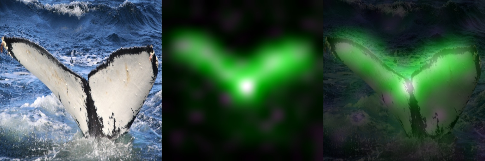
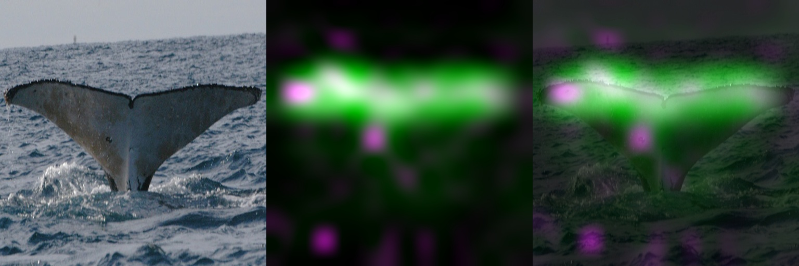

# Whale-Identification-Challenge
Using Siamese Network to analyze patterns on a Humpback Whale' tail to perform an identification task. Given Happywhale’s database of over 25,000 images, gathered from research institutions and public contributors.

